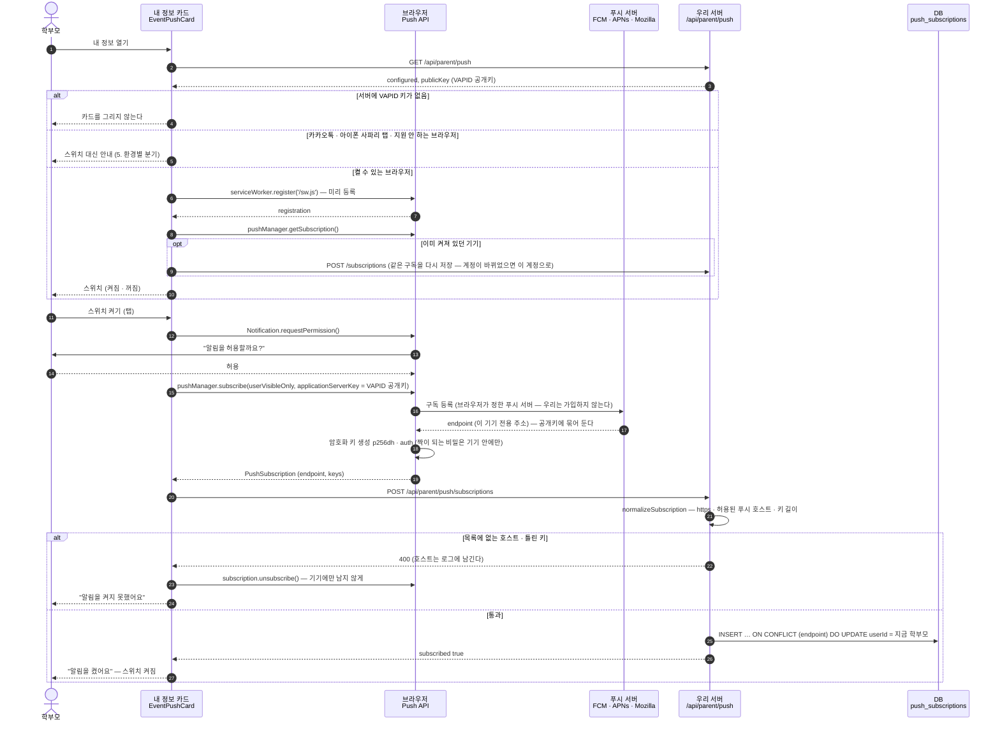
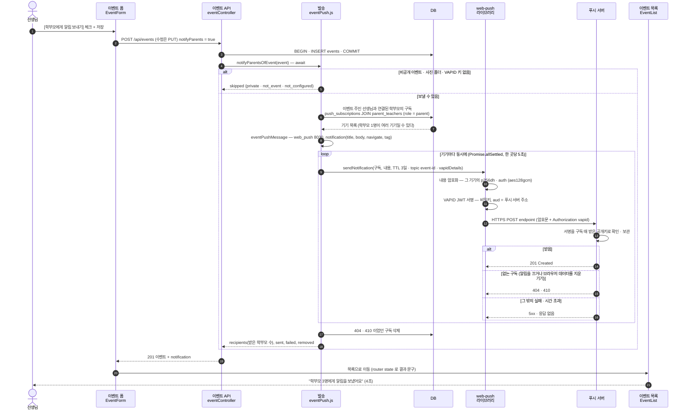
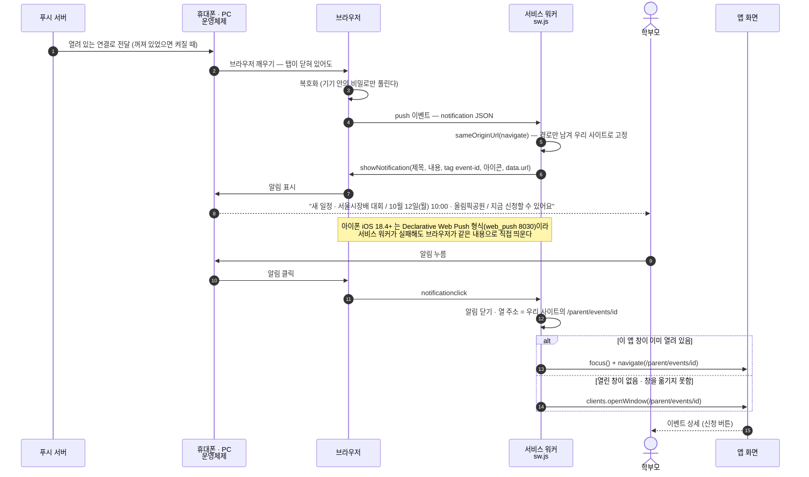
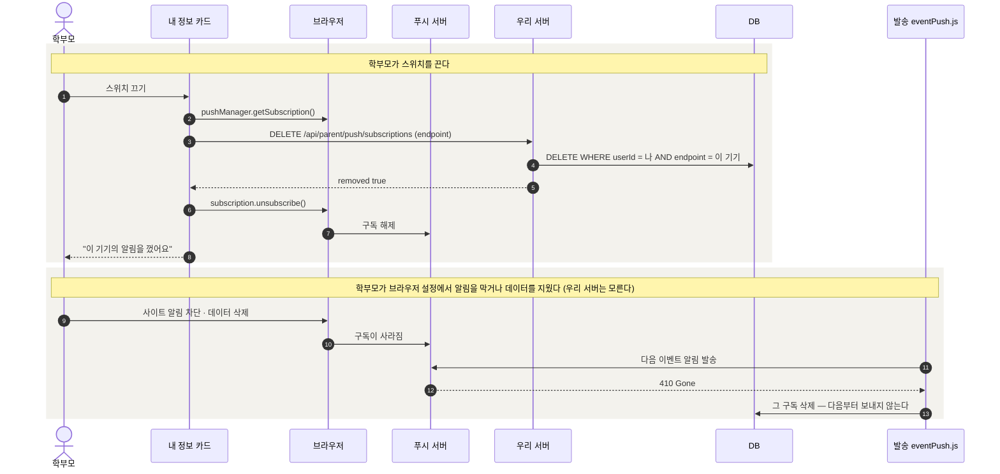
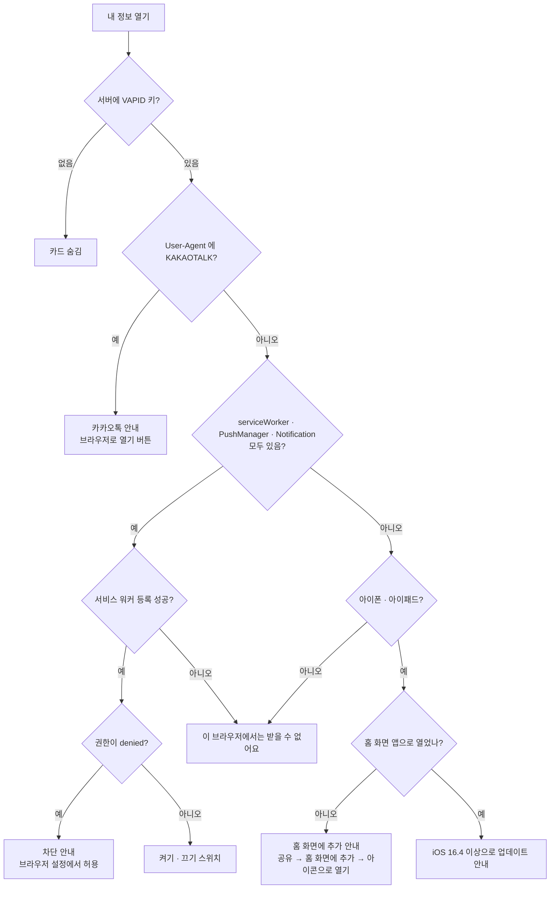

# 새 일정 브라우저 알림 — 시퀀스 다이어그램

[← README](./README.md)

네 장면으로 나눈다. 모두 실제 코드 순서 그대로다(2026-10-10, PR #72 기준).

1. [알림 켜기 (구독)](#1-알림-켜기-구독) — 학부모가 내 정보에서 스위치를 켤 때
2. [선생님 저장 → 발송](#2-선생님-저장--발송) — [학부모에게 알림 보내기] 를 체크하고 저장할 때
3. [전달 → 표시 → 누르기](#3-전달--표시--누르기) — 푸시 서버가 기기에 전하고, 학부모가 알림을 누를 때
4. [끄기 · 자동 정리](#4-끄기--자동-정리)
5. [환경별 분기](#5-환경별-분기--카드가-무엇을-보여-주나) · [결과 안내 문구](#6-선생님-화면의-결과-안내)

---

## 1. 알림 켜기 (구독)

학부모가 **내 정보** 를 열면 카드가 서버 설정을 읽고, 켤 수 있는 브라우저면 **서비스 워커를 미리 등록**해 둔다.
아이폰은 "사용자가 누른 그 순간" 에만 권한을 물을 수 있어서, 누른 뒤에 등록부터 하면 늦다.

- 권한을 **거절**하면 구독하지 않고 카드에 "알림이 차단돼 있어요 · 브라우저 설정에서 허용" 이 뜬다.
- 저장이 실패하면 기기 구독도 푼다 — 화면에는 "켜짐" 인데 알림은 안 오는 상태를 만들지 않으려고.
- 구독 주소를 허용 목록으로 거르는 이유: 서버가 나중에 그 주소로 POST 를 보내기 때문에, 아무 주소나 받으면 서버를 다른 곳을 두드리는 데 쓸 수 있다.

## 2. 선생님 저장 → 발송

체크하고 저장한 경우에만 보낸다. 서버는 **이벤트를 먼저 저장(COMMIT)** 한 뒤 보내고, **다 보낼 때까지 기다렸다가** 응답한다 —
Vercel 은 응답을 보내는 순간 인스턴스를 얼려서, 뒤로 미룬 발송은 나가지 않는다. 발송이 실패해도 저장은 그대로다.

- 체크하지 않은 저장은 `notification` 이 없고 응답 모양도 예전과 같다.
- 받는 사람 = **이벤트를 만든 선생님** 과 연결된 학부모(`parent_teachers`) — 학부모 일정에 그 이벤트가 보이는 사람과 같다.
  관리자가 남의 이벤트를 고쳐 보내도 그 선생님의 학부모에게 간다.
- `topic` · `tag` 가 `event-<id>` 라 같은 이벤트를 다시 보내면 **쌓이지 않고 바뀐다**. 휴대폰이 꺼져 있으면 푸시 서버가 **3일(TTL)** 까지 보관한다.

## 3. 전달 → 표시 → 누르기

푸시 서버는 기기와 늘 연결돼 있다(안드로이드는 구글 플레이 서비스, 아이폰은 APNs). 그래서 **탭 · 브라우저가 닫혀 있어도** 온다.

- 서비스 워커는 **푸시와 클릭만** 다룬다. 화면 파일을 가로채거나 캐시하지 않아서 앱 동작에는 영향이 없다.
- 알림 내용에 다른 사이트 주소가 와도 **경로만 남겨 우리 사이트에서** 연다(`sameOriginUrl`). 다른 사이트의 창은 쓰지 않는다.

## 4. 끄기 · 자동 정리

- 지우기는 **내 구독만** 지운다 — 다른 학부모의 endpoint 를 보내도 `userId` 가 달라 지워지지 않는다.
- 같은 기기에서 다른 학부모 계정으로 들어와 내 정보를 열면 구독이 **그 계정으로 옮겨 간다**(1번의 "다시 저장").

## 5. 환경별 분기 — 카드가 무엇을 보여 주나

`client/src/utils/pushNotifications.js:pushEnvironment`

## 6. 선생님 화면의 결과 안내

저장 응답의 `notification` → `notifyResultMessage` → 이벤트 목록에 4초 동안.

| `notification` | 안내 |
|---|---|
| `recipients > 0` | 학부모 N명에게 알림을 보냈어요 |
| `recipients = 0`, `failed = 0` | 알림을 켠 학부모가 아직 없어요 · 학부모가 내 정보에서 알림을 켜면 받을 수 있어요 |
| `recipients = 0`, `failed > 0` | 학부모 알림을 보내지 못했어요 · 잠시 뒤 다시 해 주세요 |
| `skipped: not_configured` | 알림 기능이 아직 준비되지 않아 학부모 알림은 보내지 못했어요 |
| `skipped: private` | 비공개 이벤트라 학부모 알림은 보내지 않았어요 |
| `skipped: error` | 학부모 알림을 보내지 못했어요 |
| 없음 (체크 안 함) | 안내 없이 목록으로 |

`recipients` 는 **푸시 서버가 받은** 기기가 하나라도 있는 학부모 수다. 화면에 떴는지 · 읽었는지는 알 수 없다.
