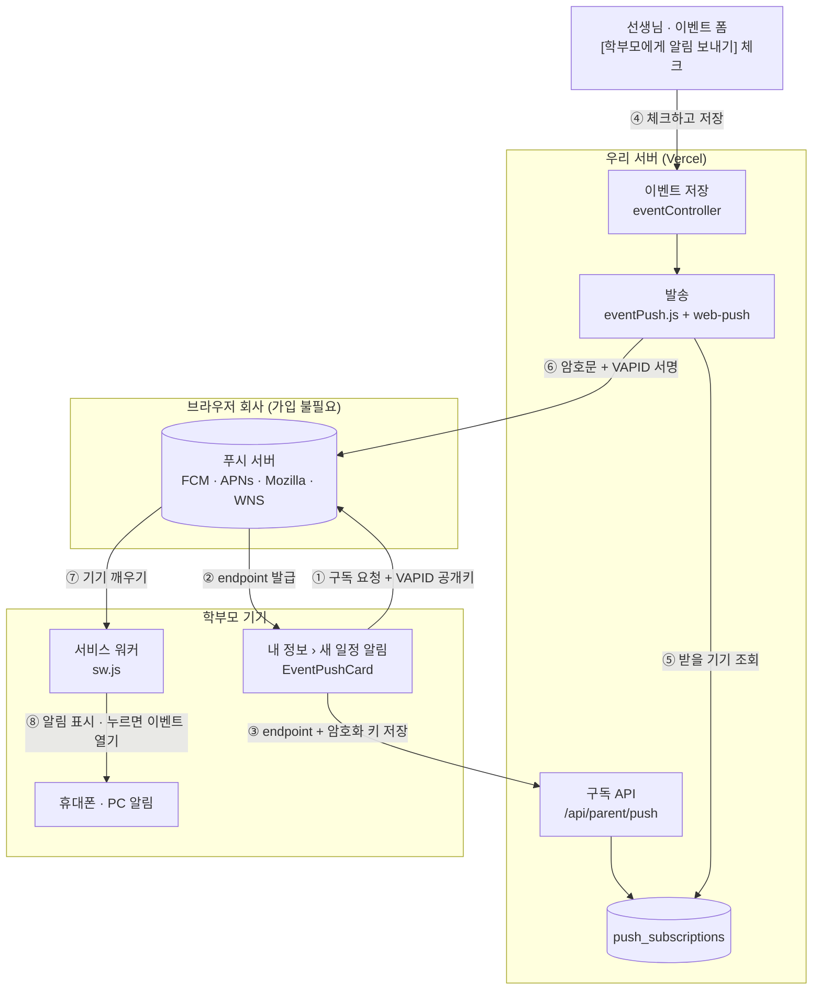

# 새 일정 브라우저 알림 (Web Push)

> **상태: 배포 완료 — 2026-10-10, PR #72** (운영 표 `push_subscriptions` · Vercel `VAPID_*` 키 포함).
> 요청: "이벤트가 열렸을 때 학부모에게 브라우저 알림" → 선생님이 이벤트를 저장할 때 **[학부모에게 알림 보내기]** 를 체크하면 보낸다.
> 학부모에게 카카오 메시지는 보내지 않는다는 결정(2026-08)은 그대로다 — 이 알림은 **학부모가 기기마다 직접 켜야** 온다.

## 한 줄 요약

학부모는 **내 정보 › 새 일정 알림** 에서 이 기기의 알림을 켠다. 선생님이 이벤트를 저장하며 체크하면, 서버가 그 선생님과
연결된 학부모의 기기마다 **암호화한 알림을 브라우저 회사의 푸시 서버(구글 FCM · 애플 APNs · 모질라 · 마이크로소프트)** 에 맡기고,
푸시 서버가 기기를 깨워 **서비스 워커(`sw.js`)** 가 알림을 띄운다. 누르면 그 이벤트 상세가 열린다.

별도 유료 서비스나 Firebase 가입은 없다. 웹 표준 **Web Push** 와 우리가 직접 만든 **VAPID 키** 한 쌍만 쓴다.

## 문서 목록

| 문서 | 내용 |
|---|---|
| [01-sequence-diagrams.md](./01-sequence-diagrams.md) | **시퀀스 다이어그램.** ① 알림 켜기(구독) ② 선생님 저장 → 발송 ③ 전달 → 표시 → 누르기 ④ 끄기 · 자동 정리, 그리고 환경별 분기 · 결과 안내 문구 |

## 전체 그림

①~③ 은 학부모가 한 번(기기마다), ④~⑧ 은 선생님이 체크하고 저장할 때마다. 단계별 자세한 순서는 [01-sequence-diagrams.md](./01-sequence-diagrams.md).

## 구성 요소

| 무엇 | 어디 | 하는 일 |
|---|---|---|
| 이벤트 폼 체크박스 | `client/src/pages/Events/EventForm.jsx` | 새 이벤트는 **켜진 채**, 수정은 **꺼진 채** 시작. 비공개면 잠긴다. `notifyParents` 로 보낸다 |
| 저장 뒤 결과 안내 | `client/src/pages/Events/EventList.jsx` · `utils/pushNotifications.js:notifyResultMessage` | "학부모 3명에게 알림을 보냈어요" 를 한 번 띄운다 |
| 발송 | `server/services/eventPush.js` | 받을 기기를 찾아 `web-push` 로 보낸다. 결과를 응답 `notification` 으로 돌려준다 |
| 알림 내용 · 검증 | `server/utils/webPush.js` | VAPID 설정 읽기, 구독 주소 허용 목록, 알림 문구(Declarative Web Push 모양) |
| 구독 API | `server/controllers/pushController.js` · `server/routes/parent.js` | `GET /api/parent/push` · `POST/DELETE /api/parent/push/subscriptions` (학부모만) |
| 구독 저장 | `server/models/PushSubscription.js` · 표 `push_subscriptions` | 기기마다 한 줄 (endpoint UNIQUE) |
| 학부모 카드 | `client/src/pages/parent/EventPushCard.jsx` · `client/src/utils/pushNotifications.js` | 켜기 · 끄기 스위치, 안 되는 환경이면 안내 |
| 서비스 워커 | `client/public/sw.js` | 푸시를 받아 알림을 띄우고, 누르면 이 앱 안의 이벤트 주소만 연다. 캐시는 하지 않는다 |
| 홈 화면 앱 | `client/public/manifest.webmanifest` · `client/index.html` | 아이폰은 홈 화면에 추가한 앱에서만 웹 푸시를 받는다 |
| Vercel 라우트 | `vercel.json` | `/sw.js`(no-cache) · `/manifest.webmanifest` 를 SPA 캐치올보다 앞에서 파일 그대로 내준다 |

## 열쇠 — 누가 무엇을 갖고 있나

| 값 | 만든 쪽 | 가진 곳 | 쓰임 |
|---|---|---|---|
| **VAPID 공개키** | 우리 (`cd server && npx web-push generate-vapid-keys`) | Vercel `VAPID_PUBLIC_KEY` · 학부모 브라우저 · 푸시 서버 | 구독을 "우리 서버" 에 묶는다 |
| **VAPID 비밀키** | 우리 | Vercel `VAPID_PRIVATE_KEY` (Sensitive) — 그 밖에는 운영자 백업뿐 | 보낼 때 서명. 이것이 있어야 우리 구독자에게 보낼 수 있다 |
| **endpoint** | 푸시 서버 | 학부모 브라우저 · `push_subscriptions.endpoint` | 그 기기로 가는 주소 (`https://fcm.googleapis.com/fcm/send/…`) |
| **p256dh · auth** | 학부모 브라우저 | 공개 부분은 DB, 짝이 되는 비밀은 기기 안에만 | 알림 내용 암호화 — 푸시 서버는 내용을 읽지 못한다 |

- **Firebase · 애플 개발자 가입이 필요 없는 이유**: 푸시 서버에 "가입" 한 쪽은 브라우저다. 우리 서버는 보낼 때마다 VAPID 비밀키로
  서명해서, 구독할 때 브라우저가 넘긴 공개키의 주인임을 증명하기만 한다. (이메일을 보내려고 받는 사람 메일 회사에 가입하지 않는 것과 같다.)
- **키 쌍은 바꾸지 않는다.** 바꾸면 기존 구독이 모두 쓸모없어져 학부모가 알림을 다시 켜야 한다. 비밀키는 비밀번호 관리자 등에 백업해 둔다.

## 운영

- **환경변수** (Vercel → Settings → Environment Variables, **Production 만**): `VAPID_PUBLIC_KEY`, `VAPID_PRIVATE_KEY`,
  선택 `VAPID_SUBJECT`(비우면 `https://rg-manager.vercel.app`). Preview 에 넣지 않는다 — 미리보기 배포는 운영 DB 를 같이 써서 실제 학부모에게 간다.
  키가 없으면 학부모 카드가 숨고, 선생님이 체크해 저장하면 "알림 기능이 아직 준비되지 않아…" 로 안내된다. 나머지는 그대로 동작한다.
- **표** `push_subscriptions`: 머지 전에 운영에 만들었다 (`OWNER TO rg_app`, 표 · 시퀀스의 공개 권한 회수).
- **로그**: 허용 목록에 없는 푸시 서비스로 구독하려 하면 `알림 구독 거절 — 목록에 없는 푸시 서비스: <host>` 가 남는다.
  실제 브라우저(예: 웨일)가 거절된 것이면 `server/utils/webPush.js` 의 목록에 더한다.

## 확인하는 법

- 단위 테스트: `server` — `webPush` · `eventPush` · `pushController` · `eventController`, `client` — `pushNotifications` · `EventPushCard` · `serviceWorker`.
- e2e: `client/e2e/push.spec.mjs` (프로젝트 `push`). Playwright 기본 창은 시크릿 모드라 크롬이 실제 구독을 막아서 화면 흐름은
  `PushManager` 를 흉내 내고, 서비스 워커는 CDP `ServiceWorker.deliverPushMessage` 로 푸시를 넣어 본다.
  **실제 푸시 서버 왕복**은 `E2E_REAL_PUSH=1` 일 때만 (프로필이 있는 Chromium 창으로 구글 푸시 서버를 실제로 거친다).

## 한계

- **카카오톡 안의 브라우저는 받을 수 없다**(웹뷰). 카드가 [브라우저로 열기] 를 안내한다.
- **아이폰 · 아이패드는 홈 화면에 추가한 앱에서만**(iOS 16.4+). 홈 화면 앱은 사파리와 저장 공간이 달라 다시 로그인해야 한다.
- 알 수 있는 것은 **"푸시 서버가 받았다"** 까지다. 화면에 떴는지 · 읽었는지는 모른다.
- 로그아웃해도 그 기기의 알림이 꺼지지는 않는다 — 같은 기기에서 다른 학부모가 내 정보를 열면 그 계정으로 옮겨 간다.
