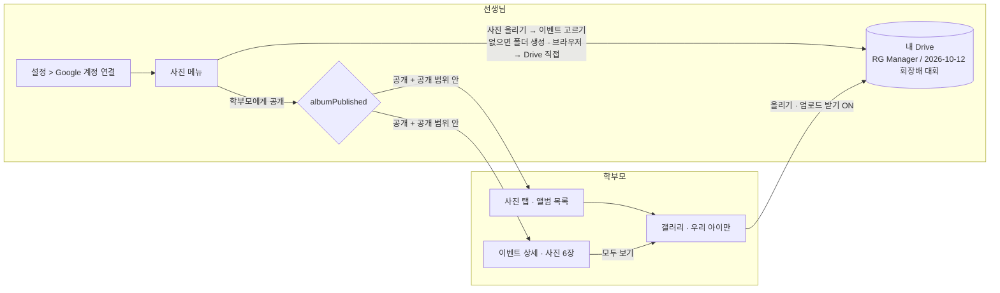

# 선생님 사진 메뉴 · Google Drive 앨범 — 계획 문서

> **상태: 초안 — 2026-10-08 · 구현 전.** 확정이 필요한 것은 아래 [결정할 것](#결정할-것) 표에 모았다. 답이 없으면 **권장안**으로 진행한다.
> 요구사항은 2026-10-08 대화에서 다섯 번에 나뉘어 왔다.
> ① 선생님마다 **본인 Google 계정**을 연결하면 사진을 관리하게 한다. 이벤트 사진은 **선생님도, 학부모도** 올린다. 폴더는 **이벤트 이름 기준**으로 Google 드라이브(포토)에 만든다.
> ② 선생님 화면에 **사진 메뉴**를 추가해 폴더 만들기·사진 올리기를 하고, **공개 여부**를 확인해 **공개하면 학부모 사진 탭에 보이게** 한다.
> ③ **이벤트 화면에서는 사진 올리기를 빼고**, 선생님이 **사진 메뉴에서 추가한 것**이 보이게 한다.
> ④ 이를 위해 선생님이 **설정에서 Google 계정을 연동**하게 한다.
> ⑤ 선생님이 **사진을 올릴 때 이벤트와 연결**할 수 있게 하고, 연결하면 학부모가 **이벤트 상세에서 그 사진을 보게** 한다.

## 한 줄 요약

선생님은 **설정**에서 본인 Google 계정을 한 번 연결한다. 새 **사진** 메뉴에서 **[사진 올리기] → "어느 이벤트 사진인가요?"** 로 이벤트를 고르고 올린다.
그러면 사진이 그 이벤트에 **연결**된다. 앨범이 없던 이벤트면 선생님 Drive 에 `RG Manager/2026-10-12 회장배 대회` 같은 **이벤트 이름 폴더**가 이때 생긴다.
앨범은 **비공개로 시작**하고, 선생님이 **[학부모에게 공개]** 를 누르면 학부모 **사진 탭**과 **그 이벤트 상세** 두 곳에 사진이 나타난다.
공개된 앨범에는 학부모도 사진을 올릴 수 있다. 이벤트 관리·이벤트 폼에는 사진 입구를 두지 않는다.

## 문서 목록

| 문서 | 내용 |
|---|---|
| [mockups/teacher-desktop.html](./mockups/teacher-desktop.html) · [teacher-mobile.html](./mockups/teacher-mobile.html) · [parent-mobile.html](./mockups/parent-mobile.html) | **HTML 목업.** 앱의 실제 CSS 로 그려서 **저장소 안에서 열어야 한다**(아래 "목업 보는 법") |
| [01-implementation-plan.md](./01-implementation-plan.md) | 현재 상태(코드·운영 데이터·보안), 요구사항 FR-500~545, 설계 결정(Drive 와 Google 포토 비교, 폴더 이름, 공개 모델), 데이터 모델·API·화면, 파일 영향, 단계별 구현 순서, 테스트·배포, 리스크, Google 준비물 |
| [02-google-setup.md](./02-google-setup.md) | **Google 연동 설정.** 연결할 때 나는 "Access blocked" 오류 해결: 테스트 사용자 등록(지금), 앱 게시(나중), 어느 계정으로 들어가는지 |
| [../photo-sharing/](../photo-sharing/README.md) | **바탕 설계** (2026-09). Drive 연결·업로드 세션·얼굴 인덱싱·학부모 갤러리는 이 문서대로 이미 구현돼 있다. 이 계획은 그 위에 **선생님 화면과 공개 단계**를 얹는다 |

## 목업 보는 법

목업은 앱의 실제 스타일(`client/src/styles/*.css`)과 로고를 상대 경로로 불러온다. 그래서 **저장소 루트에서 정적 서버를 띄워** 연다.

```bash
python3 -m http.server 8765        # 저장소 루트에서
open http://localhost:8765/docs/photo-menu/mockups/teacher-desktop.html
```

파일을 더블클릭해 `file://` 로 열어도 대부분 보이지만, 브라우저에 따라 iframe 높이 맞춤이 안 될 수 있다.

## 지금 있는 것과 이번에 하는 것

이 기능의 **서버·학부모 화면은 대부분 이미 main 에 있다**(2026-09 `feat(album)` S1~S7).
빠진 것은 **선생님 화면**과 **공개 단계**다. 선생님 화면은 2026-09-01 PR #10 에서 이벤트 폼과 함께 걷어냈다.

| 영역 | 지금 (main `42d22e2`) | 이번 |
|---|---|---|
| 설정 · Google 연결 | `Settings/DriveAccountCard.jsx` + `/api/drive/*` 동작 중 | 기능은 그대로 두고 디자인 시스템으로 옮긴다. 사진 메뉴의 미연결 안내가 여기로 보낸다 |
| 사진을 이벤트에 연결 · 폴더 만들기 | API(`POST /api/events/:id/album`)만 있다. **화면 없음** | 사진 메뉴 **[사진 올리기] → 이벤트 고르기** → 그 이벤트 앨범으로 올라간다. 앨범이 없던 이벤트면 이때 이벤트 이름 폴더를 만든다 |
| 선생님 업로드 · 관리 | API 만 있다. 화면 없음 | 사진 메뉴 앨범 화면: 올리기 · 숨기기 · 삭제 · Drive 에서 열기 |
| 공개 | 개념이 없다. 폴더가 생기면 확정 학부모에게 **바로** 보인다 | `events."albumPublished"` 추가. **기본 비공개**, 선생님이 공개해야 보인다 |
| 학부모 보기 · 올리기 | `/parent/photos` 완성. 참가 확정 학부모만 | **공개된 앨범만** 보인다. 공개 범위 규칙을 따른다 |
| 학부모 이벤트 상세 | 썸네일 4장 + "앨범 열기" 카드(앨범이 있고 확정이면) | **사진 6장을 바로 보여 주고** "모두 보기"(요청 ⑤). 공개된 앨범일 때만. 업로드는 없다 |
| 이벤트 화면 | 사진 없음 | **계속 없음** (요청 ③). 대신 제목·날짜를 고치면 폴더 이름이 따라간다 |
| 운영 데이터 | Drive 연결 0 · 앨범 0 · 사진 0 (2026-10-08 조회) | 옮길 데이터가 없다 |

## 흐름 한눈에



## 결정할 것

| # | 질문 | 권장안 (답이 없으면 이대로) | 근거 |
|---|---|---|---|
| D-1 | "구글 드라이브(포토)" 는 **Google Drive** 인가, **Google 포토**인가? | **Google Drive.** 루트 폴더 이름은 설정에서 `RG Manager 사진` 같은 이름으로 바꿀 수 있다 | Google 포토 API 는 2025-03-31 부터 **공유 앨범 API 가 막혀** 학부모에게 보여 줄 수 없다. 업로드도 앱 서버를 거쳐야 해서 영상이 막힌다. 자세한 비교는 [01 §3.1](./01-implementation-plan.md#31-저장소--google-포토가-아니라-google-drive-로-한다) |
| D-2 | 공개하면 **어느 학부모**에게 보이나? | **앨범마다 고른다. 기본값은 "참가 확정 학부모"**이고 "모든 학부모"로 바꿀 수 있다. 확정 학생이 0명이면 공개 버튼 옆에 경고를 띄운다 | 지금 규칙(확정 학부모만)으로 보면 대회 14개 중 9개, **스페셜 6개 중 2개**에만 볼 수 있는 학부모가 있다. 스페셜 이벤트는 신청 확정을 잘 안 쓴다 |
| D-3 | 폴더 이름 형식은? | **`YYYY-MM-DD 이벤트명`** (지금 기본값). 이벤트 제목·날짜를 고치면 폴더 이름도 바뀐다 | 해마다 같은 이름의 대회가 있어서 날짜가 없으면 Drive 에서 구분할 수 없다. 날짜가 앞에 오면 이름순 정렬이 곧 날짜순이다 |
| D-4 | 학부모 **이벤트 상세**에서 사진을 어떻게 보여 주나? | **사진 6장(3×2)을 바로 보여 주고 "사진 N장 모두 보기"**. 누르면 그 사진이 크게 열린다. 공개된 앨범일 때만 보인다. **업로드 버튼은 없다** | 요청 ⑤ 는 이벤트 상세에서 사진을 "보게", 요청 ③ 은 이벤트에서 "올리지 않게". 많은 사진은 갤러리에서 보는 편이 낫다 |
| D-5 | 학부모가 올린 사진은 **바로** 보이나, **선생님 승인 후** 보이나? | **바로 보인다** (지금 동작). 선생님은 언제든 숨기거나 지울 수 있다 | 승인 단계를 넣으면 상태·화면이 하나씩 더 늘어난다. 필요해지면 2차로 미룬다 |
| D-6 | 이미 있는 앨범의 공개 상태는? | 운영에는 앨범이 0개라 **기본값(비공개)만 정하고 백필은 하지 않는다** | 2026-10-08 운영 조회 결과 |
| D-7 | 이벤트에 **연결만 하면** 이벤트 상세에 보이나, **공개도 해야** 보이나? | **공개해야 보인다**(사진 탭과 같은 스위치 하나). 대신 올리는 시트에 **"다 올리면 바로 학부모에게 공개"** 체크를 둔다(기본 꺼짐) | 보이는 곳마다 스위치가 다르면 "사진 탭에는 안 보이는데 이벤트 상세에는 보이는" 상태가 생긴다. 체크 하나로 단계도 줄인다 |
| D-8 | 이벤트에 **연결하지 않고** 올리는 사진(연습 사진 등)도 받나? | **이번에는 받지 않는다.** 올릴 때 이벤트를 꼭 고른다 | 요청 ① "폴더는 이벤트 이름 기준". 이벤트 없는 앨범은 2차 후보로 둔다 |

## 먼저 풀어야 하는 것 (구현 전 · 배포 전)

1. **보안 (차단 사항):** 운영 DB 의 앨범 표 5개(`google_drive_accounts`, `event_media`, `media_faces`, `media_tags`, `child_face_profiles`)에
   **RLS 가 꺼져 있고 `anon` · `authenticated` · `service_role` 권한이 붙어 있다** (2026-10-08 확인). `google_drive_accounts` 에는 선생님 Google
   **refresh token** 이 들어가고, `child_face_profiles` 에는 아이 얼굴 벡터가 들어간다. **선생님이 처음 연결하기 전에** 권한을 회수해야 한다
   → [01 §8 S0](./01-implementation-plan.md#8-구현-순서).
2. **Google 계정 연동 (사용자 작업):** OAuth 키와 리디렉션 URI 는 운영에 이미 들어가 있다. 다만 동의 화면이 **테스트 상태**라서
   연결하면 `Error 403: access_denied` 가 난다. 선생님이 1명이므로 **선생님 Google 계정을 테스트 사용자로 등록**해서 쓴다(7일마다 다시 연결).
   → [02-google-setup.md](./02-google-setup.md). 어느 계정으로 Google Cloud 에 들어가는지, 나중에 앱을 게시하는 방법도 거기에 있다.
