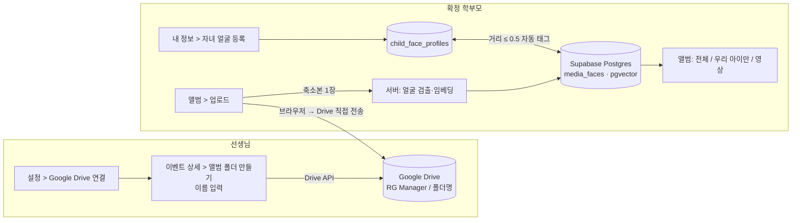

# 대회 사진 · 영상 공유 — 요구사항 문서

학부모 포털에 **대회(이벤트) 앨범**을 추가하기 위한 요구사항 문서 모음입니다.
선생님이 이벤트 상세에서 **앨범 폴더 이름을 넣으면 Google Drive 에 폴더가 만들어지고**,
그 뒤로 **선생님과 "확정된 학부모"가 그 폴더에 사진·영상을 올리고 서로의 사진을 봅니다.**
사진이 올라올 때마다 **얼굴 인덱스(128차원 벡터)를 뽑아 Supabase 에 저장**해 두었다가,
학부모가 자녀 얼굴을 등록하면 **"우리 아이만"** 필터로 자기 아이 사진만 모아 볼 수 있습니다.

원본 메모: [../학부모.md](../학부모.md) — 학부모 3 "사진 공유", 선생님 4 "대회 사진 보기 · Google Drive 업로드".
이전 분석: [../parent-portal/01-requirements.md §10.3](../parent-portal/01-requirements.md#103-사진-공유--google-drive-앨범--자녀-얼굴-인식-필터) — **이 문서가 §10.3 을 대체**합니다(달라진 점은 01 §9 참조).

## 한 줄 요약

선생님이 **설정에서 Google 계정을 한 번 연결**하고, 이벤트 상세에서 **[앨범 폴더 만들기]** 에 이름을 넣으면
앱이 선생님 Drive 에 폴더를 만든다. 선생님과 **자녀가 확정된 학부모**는 앱에서 그 폴더로 **사진·영상을 바로 올리고**(브라우저 → Drive 직접 전송),
**앨범 전체**를 본다. 사진이 올라오면 서버가 **얼굴 벡터를 Supabase(pgvector)** 에 저장하고,
학부모가 **자녀 얼굴 사진(1~3장)** 을 등록해 두면 **"우리 아이만"** 칩으로 자기 아이가 나온 사진만 걸러 본다.

## 문서 목록

| 문서 | 내용 |
|---|---|
| [01-requirements.md](./01-requirements.md) | 배경, 용어, 범위, 사용자 스토리, 기능 요구사항(FR-200~295), 비기능 요구사항, 화면, 수용 기준, **이전 분석과 달라진 점**, 열린 질문 |
| [03-implementation-plan.md](./03-implementation-plan.md) | **구현 계획** — 02 에서 바뀐 설계 3가지(벡터 저장·얼굴 검출 위치), 기존 코드 영향, 단계별 구현 순서 S1~S9, 테스트·배포·스모크 계획, Google 연동 준비물 |
| [mockups/parent.html](./mockups/parent.html) · [mockups/teacher.html](./mockups/teacher.html) | 화면 목업 (브라우저에서 바로 열림) |
| [02-data-model-api.md](./02-data-model-api.md) | DB 스키마(pgvector 포함), Google Drive 연동 방식, 업로드 시퀀스, REST API, 순수 함수(테스트 대상), 프론트 라우트, 마이그레이션, 환경변수, 리스크 |

## 전제 (먼저 있어야 하는 것)

[학부모 포털 MVP](../parent-portal/README.md) — 학부모 계정(`users.role='parent'`), 자녀 연결(`parent_children`), 이벤트(`events`),
신청·확정(`event_registrations.status='confirmed'`). 이 문서는 그 위에 **앨범** 메뉴를 얹는다.

## 흐름 한눈에

## 핵심 결정 요약

| 주제 | 결정 | 이유 |
|---|---|---|
| Drive 인증 | **선생님 Google OAuth(`drive.file`)**. 폴더·파일은 선생님 계정 소유 | 앱이 폴더를 만들고 파일을 써야 하므로 읽기 전용 API 키로는 불가. `drive.file` 은 Google 검수가 필요 없는 범위 |
| 학부모 업로드 | 학부모는 Google 계정 없이 **앱만으로** 업로드. 서버가 선생님 토큰으로 Drive 업로드 세션을 만들어 주고, 브라우저가 Drive 에 **직접** 전송 | 학부모는 카카오 로그인뿐. 서버(Vercel)는 파일 바이트를 거치지 않아 4.5MB·시간 제한을 피함 |
| 폴더 공유 | 생성 시 **"링크가 있는 모든 사용자 — 보기"** 자동 설정 | 앱 갤러리의 썸네일·영상 재생이 Drive 링크를 그대로 쓰기 위해 (Q-2 에서 확인) |
| 보는 사람 | **확정 학부모 + 선생님**. 미확정 학부모는 앨범 없음 | 메모 "확정된 학부모의 경우" (Q-1 에서 확장 여부 확인) |
| 얼굴 인덱싱 | **업로드 완료 시 1장씩 자동**, 서버(Vercel)에서 face-api.js, 벡터는 **Supabase pgvector** | 메모 "사진 올리면 얼굴 인덱스 값을 추출해서 supabase 에 저장" |
| 영상 | 업로드·재생 지원, **얼굴 인덱싱은 하지 않음** | 프레임 추출은 서버리스에서 무겁다. 수동 태그로 보완 |
