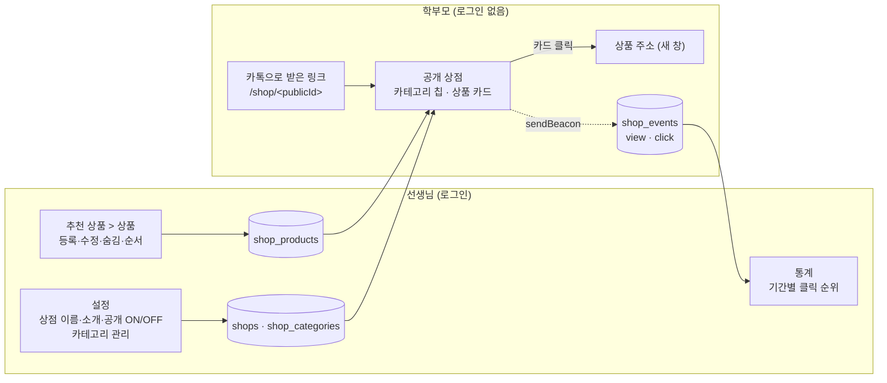

# 선생님 추천 상품 (공개 상점) — 설계 문서

선생님이 학부모에게 권하는 상품(발레복·레오타드·기구·슈즈 …)을 **온라인 상점처럼 한 페이지에 모아 보여 주는** 기능입니다.
페이지는 **로그인 없이** 열리고, 선생님은 **어떤 상품 링크가 많이 클릭됐는지** 통계로 봅니다.

## 원본 요청 (2026-10-04)

> 선생님이 추천하는 상품을 학부모들에게 보여주고 싶어. 상품을 등록하면 온라인 상점처럼 보일 수 있게 해주고,
> 해당 페이지는 로그인 없이도 볼 수 있게 해줘.
> 상품 등록시에는 연결할 주소, 타이틀, 이미지, 그리고 상품 종류(예: 발레복, 기구와 같은 여러 카테고리)를 선택할 수 있게 해줘.
> 그리고 가격도 보여줄 수 있게 해줘. 필수 입력은 타이틀로 해줘.
> 선생님은 어떤 상품 링크가 많이 클릭됐는지 통계도 볼 수 있게 구현해줘.

## 한 줄 요약

선생님은 **추천 상품** 메뉴(`/products`)에서 상품을 등록한다(**타이틀만 필수**, 링크·이미지·카테고리·가격은 선택).
상점마다 추측 불가능한 **공개 링크 `/shop/<publicId>`** 가 하나 있고, 이걸 카카오톡 등으로 보내면 학부모는 로그인 없이
**카테고리 칩 + 상품 카드 그리드**를 보고, 카드를 누르면 상품 주소가 새 창으로 열린다. 그 순간 클릭이 기록되어
선생님은 **통계** 탭에서 기간별 **상품 클릭 순위**를 본다.

## 문서 목록

| 문서 | 내용 |
|---|---|
| [01-requirements.md](./01-requirements.md) | 용어, 범위, 사용자 스토리, 기능 요구사항(FR-400~466), 비기능 요구사항, 화면 목록, 수용 기준, **열린 질문(기본 가정 포함)** |
| [02-data-model-api.md](./02-data-model-api.md) | DB 스키마(테이블 4개), 순수 함수, REST API(선생님·공개), 공개 응답 화이트리스트, 클릭 기록 방식 결정, 통계 쿼리, 레이트 리밋 |
| [03-implementation-plan.md](./03-implementation-plan.md) | 기존 코드 영향, 새 파일, 단계별 구현 순서 S1~S7, 테스트 계획(단위·e2e·브라우저), **배포 체크리스트(DDL 선적용)**, 리스크 |
| [04-images-description.md](./04-images-description.md) | **2차** — 사진 여러 장 · 순서 · 자르기 · 상세 설명 · 상품 상세(캐러셀). 정한 것, 데이터(사진 표 · 1차 사진 옮기기), API, 저장 흐름, 배포 |
| [mockups/teacher-desktop.html](./mockups/teacher-desktop.html) · [teacher-mobile.html](./mockups/teacher-mobile.html) | 선생님 화면 목업 — 상품 목록 · 등록/수정 · 삭제 확인 · 통계 · 설정 · 빈 상태 (+ 모바일 메뉴) |
| [mockups/parent-desktop.html](./mockups/parent-desktop.html) · [parent-mobile.html](./mockups/parent-mobile.html) | 학부모 화면 목업 — 공개 상점 · 카테고리 필터 · 로딩 · 빈 상점 · 비공개 · 오류 |
| [mockups/images-desktop.html](./mockups/images-desktop.html) · [images-mobile.html](./mockups/images-mobile.html) | **2차 목업** — 상품마다 사진 여러 장 · 순서 · 자르기 · 상세 설명, 상품 상세(모바일 캐러셀 · 데스크톱 큰 사진 + 작은 사진) |

## 흐름 한눈에

## 핵심 결정 요약

| 주제 | 결정 | 이유 |
|---|---|---|
| 공개 범위 | 선생님별 상점 1개, **추측 불가능한 공개 링크** `/shop/<publicId>` (128비트 난수) | FAQ 공개 채팅(`/chat/:publicId`)과 같은 방식 — 로그인 없이 열리되 주소를 아는 사람만 본다. 이미 검증된 패턴과 유틸(`generatePublicId`)을 그대로 쓴다 |
| 필수 입력 | **타이틀만**. 링크·이미지·카테고리·가격은 모두 선택 | 요청 그대로. 링크가 없는 상품은 "보여 주기만" 하는 카드(클릭 불가·통계 없음) |
| 이미지 | 선생님이 **파일로 업로드** → Supabase Storage(기존 버킷, `shop/` 경로). 브라우저에서 긴 변 1,200px로 줄여 올린다 | 쇼핑몰 이미지 주소를 그대로 걸면 외부 사이트의 핫링크 차단으로 자주 깨진다. 업로드 인프라(`utils/storage.js`, raw body, 확장자 기준 MIME)는 FAQ 파일에서 이미 운영 중 |
| 카테고리 | 선생님이 관리하는 목록. 상점 생성 시 **기본값 5개**(발레복·레오타드·기구·슈즈·용품)를 넣어 주고 추가·이름 변경·삭제·순서 변경 가능. 상품당 1개 선택(선택 안 함 = 기타) | "여러 카테고리 중 선택" + 고정 목록은 학원마다 맞지 않는다. 바로 쓸 수 있게 기본값을 채워 둔다 |
| 가격 | 정수(원), 선택. 비우면 카드에 가격을 표시하지 않음 | 링크 상품 가격은 자주 바뀐다 — "참고 가격" 성격 |
| 클릭 기록 | 카드는 **실제 상품 주소로 바로 연결**(`target=_blank`)하고, 누르는 순간 `navigator.sendBeacon` 으로 클릭을 보낸다 | 서버 리다이렉트(`/go/:id`)는 Vercel 콜드스타트만큼 이동이 느려지고, 학부모가 링크를 길게 눌러 복사하면 우리 주소가 복사된다. 비콘은 페이지 이동 중에도 전송이 보장된다(02 §5) |
| 통계 | 기간(7일·30일·90일·전체) × **상품별 클릭 수 · 클릭한 방문자 수 · 마지막 클릭**, 상점 방문 수, 카테고리별 합계 | "어떤 상품 링크가 많이 클릭됐는지" 에 바로 답한다. 방문 수가 있어야 클릭이 많은지 적은지 판단할 수 있다 |
| 방문자 식별 | 브라우저별 난수 `visitorKey`(기존 `utils/visitorStorage.js`). **IP·기기 정보는 저장하지 않는다** | 같은 사람이 여러 번 누른 것과 여러 사람이 누른 것을 구분하되 개인정보는 남기지 않는다 |
| 학부모 포털 노출 | 이번 범위는 **공개 링크만**. 로그인한 학부모 포털 탭 연결은 2차(열린 질문 Q-2) | 링크 하나로 로그인 여부와 상관없이 모두 같은 화면을 본다 — 먼저 이것으로 충분한지 확인 |

열린 질문과 지금 둔 기본 가정은 [01 §9](./01-requirements.md#9-열린-질문) 에 있습니다. 답이 바뀌면 그 부분만 고치고 구현에 들어갑니다.

## 목업 보는 법

`mockups/` 의 갤러리 4개(`teacher-desktop.html`, `teacher-mobile.html`, `parent-desktop.html`, `parent-mobile.html`)를 브라우저로 열면 됩니다. 위쪽 버튼으로 서로 오갑니다.

- 화면은 **앱의 실제 스타일**(`client/src/styles/tokens.css · ui.css · App.css`)을 그대로 불러오고, `components/ui` 가 그리는 DOM 과 같은 마크업으로 만들었습니다. 그래서 **저장소 안에서 열어야** 스타일이 적용되고, 앱 디자인이 바뀌면 목업도 같이 바뀝니다.
- 이번 기능에 새로 필요한 스타일(상품 카드·그리드·썸네일 등)은 구현하면서 `client/src/styles/ui.css` 맨 아래 "추천 상품" 블록으로 옮겼습니다. 목업도 그 스타일을 그대로 씁니다.
- 각 화면은 `teacher-screens.html?s=…` / `parent-screens.html?s=…` 를 iframe 으로 띄운 것이라, 데스크톱(1280px)·모바일(390px)에서 앱의 반응형 규칙이 실제 기기처럼 적용됩니다(표 → 카드, 모달 → 바텀시트).
